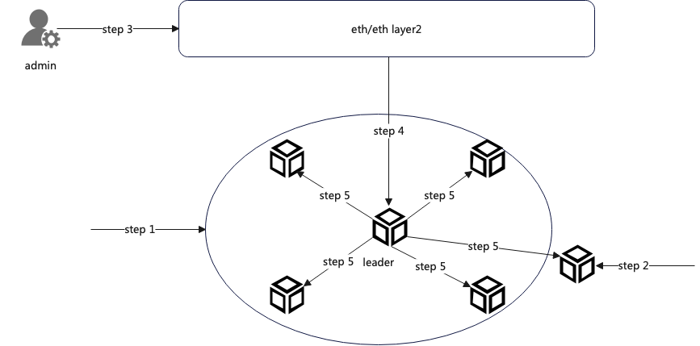

# TSS

## Concept Definitions:
Leader (Proposer): The person who initiates a consensus proposal.

Validator: A participant in the verification of consensus proposals.

Candidate: A person eligible to compete for the role of leader.

Proposal: A suggestion or request initiated by the leader.

Owner: The contract manager.

## Prerequisites:
- Only the leader can initiate a proposal for a new task or event. Other nodes (validators) verify the proposal. If the verification is correct, they participate in consensus signing; otherwise, the proposal is discarded.
- At any given time, there is only one leader (proposer) in the system.
- Initializing the system or changing the node group requires all participating nodes to be online and interactive; otherwise, the operation will fail.
- For proposal verification and consensus signing, the number of validators must be at least 2/3 of the total number of nodes.
- In this system, nodes, participants, and members are synonymous.

## Changing the Group (Adding Nodes)
Suppose there are currently 5 nodes participating in consensus, 
the current group has 5 consensus members, and we need to add one more node to participate in consensus, making the new group have 6 consensus members. 
Here, we assume there are no ongoing tasks in the current system when adding a new node:

1. Start all 5 nodes of the current group and keep them online simultaneously.
2. Initialize the new node and start it.
3. The contract manager initiates a contract call to the management contract, generating an event for the new node joining.
4. The leader node listens for the new node joining event, initiates a consensus proposal, and sends it through the network to other validators. Validator nodes, upon hearing of the new node joining event, store the event locally but do not initiate a proposal.
5. validators receive the proposal initiated by the leader, verify its correctness, such as checking the proposer, group ID, new node information, etc. If correct, they participate in consensus signing; otherwise, they discard the proposal. (At this point, the new node acts as a Validator and participates in verification.)
6. Wait for all nodes to complete consensus, generate new group information, and save it locally.
7. After the group change, the new node continues to run, participating in consensus, listening for, and accepting tasks.

## Changing the Group (Removing Nodes)
The process for removing a node is similar, except there is no second step as described above. Note: After the group change, the old node can be shut down.